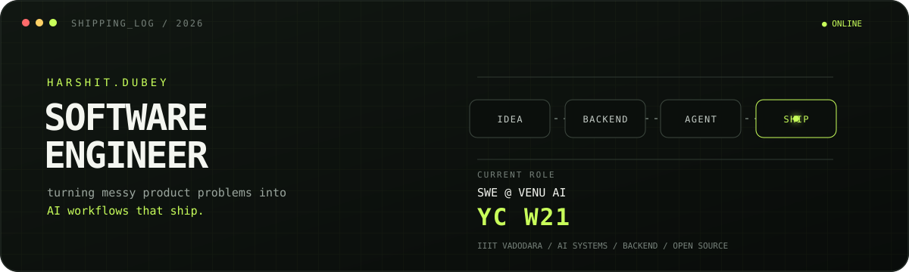

<div align="center">
  
</div>

<p align="center">
  <a href="https://www.linkedin.com/in/dubeyharshit0605/">LinkedIn</a>
  &nbsp;·&nbsp;
  <a href="https://harshit-dubey-swe.vercel.app/#top">Portfolio</a>
  &nbsp;·&nbsp;
  <a href="mailto:dubeyharshit0605@gmail.com">Email</a>
  &nbsp;·&nbsp;
  <a href="https://github.com/search?q=is%3Apr+author%3Adubeyharshit0605&type=pullrequests">Open-source work</a>
</p>

### `01 / operator`

I'm **Harshit** — **Software Engineer @ Venu AI · Y Combinator W21** and a CS undergrad at **IIIT Vadodara**.

I like the part of engineering where the problem is still fuzzy: finding the useful shape, designing the system, and pushing it across the line into a product people can actually use. My current orbit is **agentic AI, backend systems, and developer tooling**.

```text
input   ambiguous product problem
process product thinking × backend engineering × fast iteration
output  a reliable feature in users' hands
```

### `02 / now shipping`

- Building AI-powered product workflows and full-stack features at **Venu AI**
- Going deeper on **agents, RAG, tool calling, evaluations, and AI infrastructure**
- Growing an [AI storage platform](https://github.com/dubeyharshit0605/ai-storage-platform) from a file service into an intelligent processing system
- Contributing small, useful changes to open-source products I genuinely use

### `03 / proof of work`

| Build | What it explores | Signal |
|:--|:--|:--|
| [**Text to Learn**](https://github.com/dubeyharshit0605/Text-to-learn) | Turns source material into a structured learning experience | GenAI · full stack |
| [**Rubik's Cube Studio**](https://github.com/dubeyharshit0605/rubiks-cube-studio) | A tactile, interactive cube experience for the web | TypeScript · interaction |
| [**AI Storage Platform**](https://github.com/dubeyharshit0605/ai-storage-platform) | Backend-first system evolving toward AI-assisted processing | APIs · architecture |

### `04 / open-source transmission`

I learn unfamiliar codebases by leaving them a little better than I found them.

- [`wasp-lang/wasp`](https://github.com/wasp-lang/wasp/pulls?q=is%3Apr+author%3Adubeyharshit0605) — merged documentation UX fixes
- [`tsouth89/toolport`](https://github.com/tsouth89/toolport/pull/393) — merged ConfirmDialog test coverage
- [`rowboatlabs/rowboat`](https://github.com/rowboatlabs/rowboat/pull/782) — product UI work for grouped web-search results

### `05 / engineering pipeline`

```text
PRODUCT       React · Next.js · TypeScript · Flutter
SERVICES      Node.js · FastAPI · Django · REST · authentication
INTELLIGENCE  LLM APIs · RAG · agents · tool calling · evaluation
DATA + SHIP   PostgreSQL · MongoDB · Docker · Azure · GitHub Actions
FOUNDATIONS   C++ · DSA · OOP · DBMS · system design
```

### `06 / problem-solving engine`

`Codeforces Specialist` &nbsp;·&nbsp; `LeetCode Knight` &nbsp;·&nbsp; `CodeChef 4★`

Algorithms are my gym: constraints in, trade-offs surfaced, clean solution out.

---

<p align="center">
  <samp>BUILD THE USEFUL THING · MAKE IT RELIABLE · SHIP THE NEXT ITERATION</samp>
</p>
