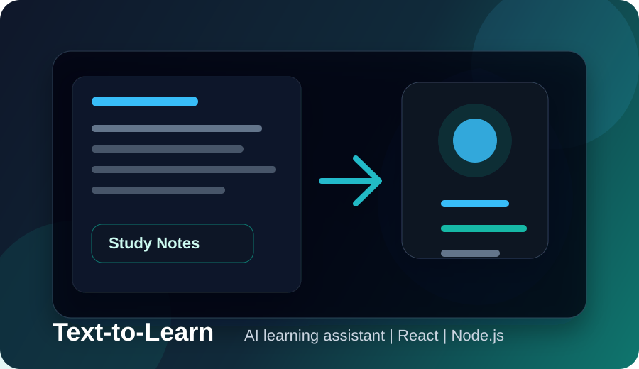
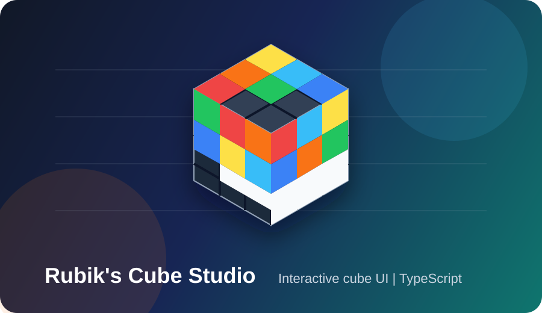
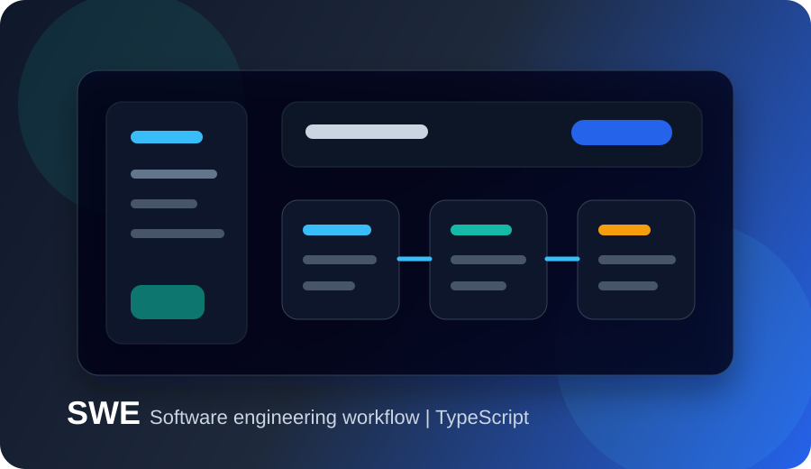
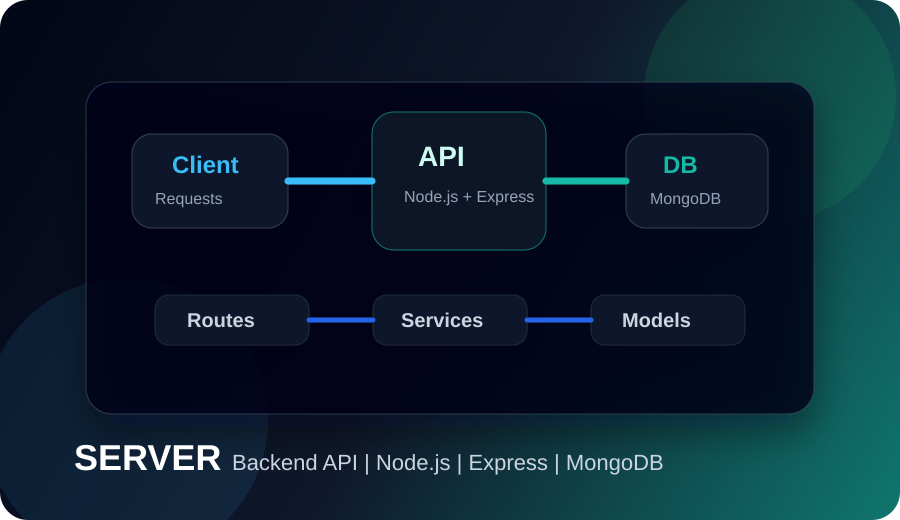

<p align="center">
  
</p>

<p align="center">
  
</p>

<p align="center">
  <a href="https://github.com/dubeyharshit0605">
    
  </a>
  <a href="mailto:dubeyharshit0605@gmail.com">
    
  </a>
  
</p>

<p align="center">
  
  
  
</p>

## Recruiter Snapshot

| Field | Details |
| --- | --- |
| Role Target | Full-stack Developer, Backend Developer, Flutter Developer |
| Core Stack | React, JavaScript, TypeScript, Node.js, Express, MongoDB, Flutter |
| Current Focus | Backend architecture, GenAI apps, DSA, system design |
| Strength | Turning ideas into clean, usable projects with clear documentation |
| Availability | Open to internships, entry-level SDE roles, and collaborations |

## Portfolio Highlights

<p align="center">
  <a href="https://github.com/dubeyharshit0605/Text-to-learn">
    
  </a>
  <a href="https://github.com/dubeyharshit0605/rubiks-cube-studio">
    
  </a>
</p>

<p align="center">
  <a href="https://github.com/dubeyharshit0605/SWE">
    
  </a>
  <a href="https://github.com/dubeyharshit0605/SERVER">
    
  </a>
</p>

## What I Build

```txt
Full-stack web apps      React, JavaScript, TypeScript, Node.js
Backend systems          Express, MongoDB, REST APIs, auth flows
Mobile apps              Flutter, Dart, clean UI flows
GenAI products           Learning tools, assistants, automation ideas
CS fundamentals          DSA, OOP, DBMS, system design basics
```

## Engineering Toolkit

<p align="center">
  
</p>

## Proof Of Work

| Area | Evidence |
| --- | --- |
| Product Thinking | Projects are built around practical use cases, not only syntax practice |
| Backend Skill | API structure, routes, database integration, and server-side logic |
| Frontend Skill | React interfaces, reusable UI, deployment-ready project structure |
| Mobile Skill | Flutter development and app-focused workflows |
| Growth Mindset | Active focus on DSA, system design, and GenAI development |

## GitHub Analytics

<p align="center">
  
  
</p>

<p align="center">
  
</p>

## Current Mission

- Build production-ready full-stack and GenAI projects
- Improve backend design, authentication, and database modeling
- Practice DSA consistently for stronger problem solving
- Document every serious project so recruiters can understand it in under one minute

## Let's Connect

<p align="center">
  <a href="mailto:dubeyharshit0605@gmail.com">
    
  </a>
  <a href="https://github.com/dubeyharshit0605">
    
  </a>
</p>

<p align="center">
  
</p>
