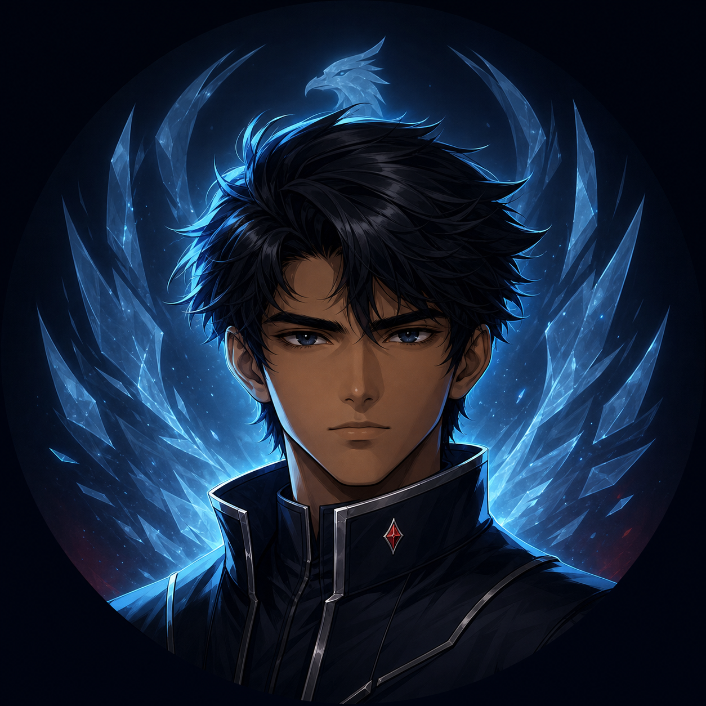
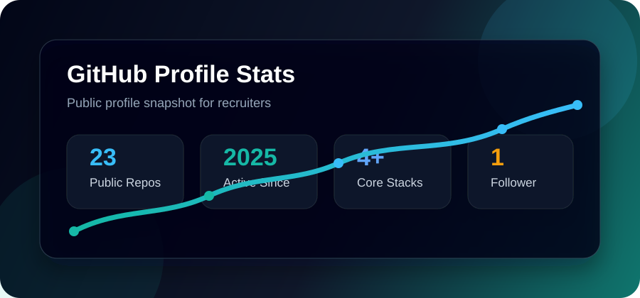
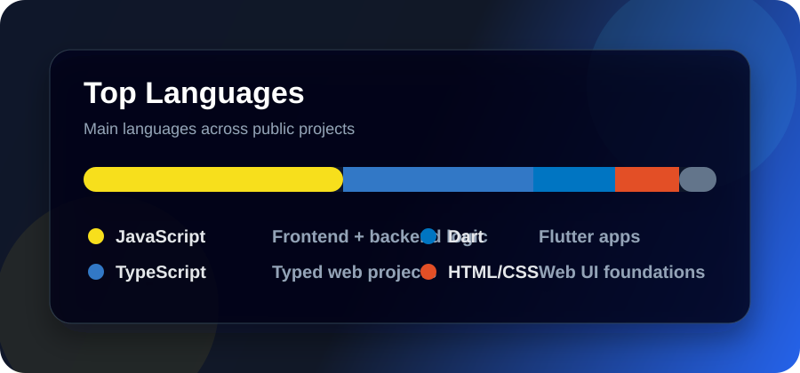
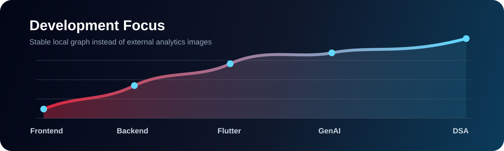

<p align="center">
  
</p>

<p align="center">
  
</p>

<h1 align="center">HARSHIT DUBEY</h1>

<p align="center">
  <strong>BUILT IN SILENCE. SHIPPED WITH PRECISION.</strong>
</p>

<p align="center">
  Full-stack developer · Backend builder · Flutter engineer · GenAI explorer
</p>

<p align="center">
  <a href="https://github.com/dubeyharshit0605">
    
  </a>
  <a href="mailto:dubeyharshit0605@gmail.com">
    
  </a>
  
</p>

<p align="center">
  
</p>

---

## 01 // OPERATING CODE

```txt
Mindset       Stay calm. Learn deeply. Execute cleanly.
Craft         Useful products over disposable demos.
Method        Understand → design → build → verify → ship.
Standard      Clear code, intentional UX, honest documentation.
Direction     Full-stack engineering, backend systems, and applied AI.
```

> I turn practical problems into focused products—without unnecessary noise.

## 02 // ARSENAL

<p align="center">
  
</p>

| System | Tools |
| --- | --- |
| Frontend | React, TypeScript, JavaScript, Tailwind CSS |
| Backend | Node.js, Express, REST APIs, authentication |
| Data | MongoDB, schema design, application data flows |
| Mobile | Flutter, Dart, clean interface architecture |
| Applied AI | GenAI applications, assistants, automation |
| Foundations | DSA, OOP, DBMS, system design |

## 03 // SELECTED BUILDS

| Project | Objective | Stack / Focus |
| --- | --- | --- |
| [Text-to-Learn](https://github.com/dubeyharshit0605/Text-to-learn) | Turn source material into a structured learning experience | Product thinking, GenAI, full stack |
| [Rubik's Cube Studio](https://github.com/dubeyharshit0605/rubiks-cube-studio) | Build an interactive cube-focused web experience | UI engineering, interaction |
| [SWE](https://github.com/dubeyharshit0605/SWE) | Explore a software-engineering platform concept | Full-stack architecture |
| [SERVER](https://github.com/dubeyharshit0605/SERVER) | Develop and document backend services | APIs, server-side engineering |

## 04 // CURRENT CAMPAIGN

- Contribute meaningful fixes to open-source products
- Build production-ready full-stack and GenAI applications
- Strengthen backend architecture, authentication, and data modeling
- Practice DSA and system design with consistency
- Document serious projects so their value is clear in under one minute

## 05 // ENGINEERING SIGNAL

<p align="center">
  
  
</p>

<p align="center">
  
</p>

## 06 // RECRUITER SNAPSHOT

| Signal | Detail |
| --- | --- |
| Target | Full-stack, backend, Flutter, and entry-level SDE roles |
| Strength | Converting ideas into usable, documented products |
| Current edge | Backend architecture, GenAI, DSA, and system design |
| Collaboration | Open-source contributions and product-focused teamwork |
| Location | India |

---

<p align="center">
  
  
</p>

<p align="center">
  <strong>Discipline compounds. So does good code.</strong>
</p>
